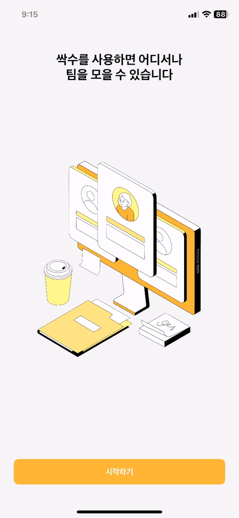
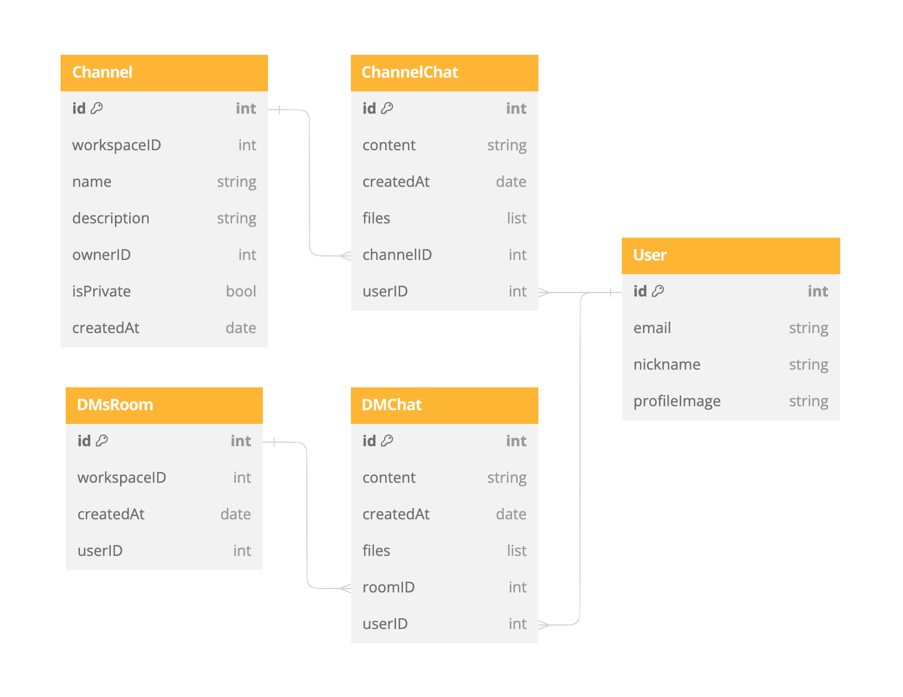
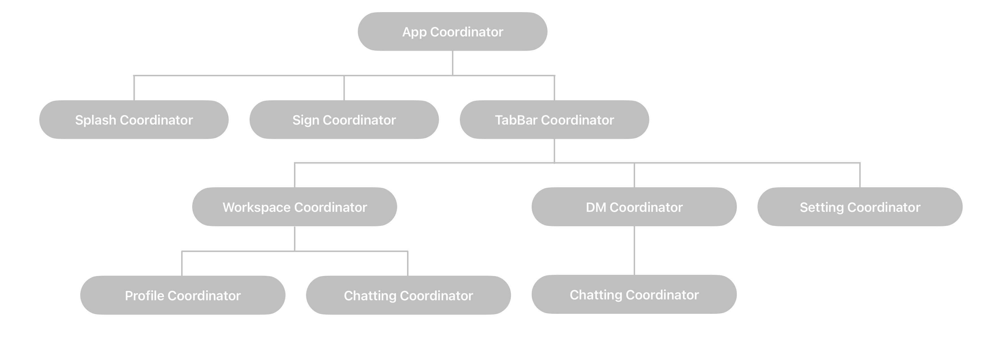

# SsacSu
새싹 개발자들이 수다 떨 수 있는 채팅 앱

||||
|:-:|:-:|:-:|
|애플 로그인|카카오 로그인|이메일 로그인|
||||
|회원가입|푸시 알림|결제|

||
|:-:|
|채팅|

## 목차

[프로젝트 정보](#프로젝트-정보)  
[주요 기능](#주요-기능)  
[기술 스택](#기술-스택)  
[구현 내용](#구현-내용)  
[문제 및 해결](#문제-및-해결)  
[회고](#회고)

## 프로젝트 정보

- 최소 버전: iOS 15.0
- 개발 환경: Xcode 15.0.1, swift 5.9
- 개발 기간: 24.01.03 ~ 23.02.29 (약 2개월)
- 개발 인원: 1명

## 주요 기능

- 소셜(카카오/애플), 이메일 로그인
- 채팅 기능
- 푸시 알림 기능
- 결제 기능

## 기술 스택

- `UIKit` `CodebaseUI`
- `MVVM-C` `Clean Architecture`
- `SnapKit(5.7.0)` `RxSwift(6.6.0)` `RxDataSources(5.0.2)`
- `KakaoOpenSDK(2.20.0)` `AuthenticationServices`
- `Moya(15.0.3)` `SocketIO(4.7.4)` `Kingfisher(7.11.0)`
- `Realm(10.47.0)`
- `Firebase(10.21.0)` `iamport-ios(1.4.1)`

## 구현 내용

- MVVM-C와 Clean Architecture를 적용하여 관심사를 분리. 효율적이고 유지보수가 용이하도록 구현
- xcconfig 파일을 이용한 Key 값 관리
- AuthenticationServices와 KakaoSDK를 이용한 소셜 로그인 구현
- Realm을 이용한 채팅 내역 관리
- SocketIO를 이용한 실시간 채팅 기능 구현
- Firebase Cloud Messaging을 이용한 Remote Push Notification 구현
- iamport를 이용한 In-App PG 결제 구현

### ERD



### Architecture




## 문제 및 해결

### 1. accessToken 만료 시 서버 통신

#### 🚨 문제 상황

로그인 이후의 통신은 대부분 accessToken이 필요. accessToken의 기간이 만료되었다면 refreshToken을 활용하여 새로운 accessToken을 받아와서 다시 통신을 진행해줘야 함. (통신 시도 - access token 만료 - refresh token 갱신 - 통신 재시도) 이 흐름을 모든 통신 메서드마다 구현하는 것은 비효율적!

#### ✅ 해결

RequestInterceptor를 활용하여 통신이 실패했을 때 accessToken을 재발급 받고 실패했던 통신을 다시 진행하도록 함.

```swift
final class AccessTokenRefreshInterceptor: RequestInterceptor {
    
    var retryCount = 0
    let maximumRetryCount = 3
    
    func adapt(_ urlRequest: URLRequest, for session: Session, completion: @escaping (Result<URLRequest, Error>) -> Void) {
        let accessToken = Token.shared.load(account: .accessToken) ?? ""
        let refreshToken = Token.shared.load(account: .refreshToken) ?? ""
        
        var urlRequest = urlRequest
        urlRequest.setValue(accessToken, forHTTPHeaderField: "Authorization")
        urlRequest.setValue(refreshToken, forHTTPHeaderField: "RefreshToken")
        
        completion(.success(urlRequest))
    }
    
    func retry(_ request: Request, for session: Session, dueTo error: Error, completion: @escaping (RetryResult) -> Void) {
        guard retryCount < maximumRetryCount else {
            completion(.doNotRetry)
            return
        }
        
        guard let response = request.task?.response as? HTTPURLResponse,
                response.statusCode == 400 else {
            completion(.doNotRetryWithError(error))
            return
        }
        
        AuthManager.shared.refreshAccessToken { result in    
            switch result {
            case .success:
                completion(.retry)
                
            case .failure(let error):
                completion(.doNotRetryWithError(error))
            }
        }
    }
    
}
```

- adapt
  - 서버에 통신을 보내기 전에 전처리를 할 수 있도록 해줌
  - Header에 accessToken과 refreshToken을 추가하도록 구현, 토큰 누락의 가능성을 배제
- retry
  - response가 fail일 경우 실행
  - status code가 400일 때 retry 진행
  - refreshToken을 재발급 받은 뒤 `completion(.retry)`로 실패한 통신 재진행

### 2. 채팅 내역 관리

#### 🚨 문제 상황

채팅 방에 들어갈 때마다 모든 대화 내역을 서버에서 불러오는 것은 비효율적.

#### ✅ 해결

Realm을 이용하여 데이터베이스에 채팅 내역을 저장하고, 마지막 채팅 이후에 전송된 채팅만 서버에서 받아오도록 구현.

1. 채팅 방 입장시 DB에서 마지막 채팅 날짜를 가져오기
2. 마지막 날짜 이후의 채팅을 서버에 요청
3. 받아온 채팅 DB에 저장
4. 최근 날짜 순으로 n개 채팅 가져오기
5. view update

```swift
func fetchChat(of channelID: Int, completion: @escaping ([ChannelChat]) -> Void) {
    // 채널 정보 불러오기
    guard let channel = realmManager.fetchSingleChannel(of: channelID) else { return }
    
    let dateStr = {
        // 1. 마지막 채팅 날짜 가져오기
        guard let date = realmManager.checkLastDate(of: channelID) else { return "" }
        
        return DateFormatter.iso8601.string(from: date)
    }()
    
    // 2. DB에 채팅 기록 있으면 마지막 채팅 이후 데이터 요청. 없으면 전체 채팅 데이터 요청.
    networkService.processResponse(
        api: .channel(.fetchChats(workspaceID: channel.workspaceID,
                                  channelName: channel.name,
                                  date: dateStr)),
        responseType: [ChannelChatResponseDTO].self) { [unowned self] response in
            switch response {
            case .success(let success):
                // 3. 받아온 채팅 DB에 저장
                success.forEach { realmManager.addChat(to: channelID, $0) }
                
                // 4. 최근 날짜 순으로 30개 채팅 가져오기
                let chats = realmManager.fetchChat(of: channelID, 30)
                completion(chats)
                
            case .failure(let failure):
                print("채팅 불러오기 실패", failure)
            }
        }
}
```


### 3. 소켓 open, close timing

#### 🚨 문제 상황

채팅 화면에서 홈 화면으로 나가는 경우 소켓이 종료되지 않음. 앱을 사용하지 않을 때에도 소켓이 계속 연결되어 있어 불필요한 네트워크 트래픽과 리소스 낭비 발생!

#### ✅ 해결

앱이 Background 상태가 될때에는 소켓 연결을 해제, Active 상태가 될 때에는 연결을 재개.

```swift
func sceneDidBecomeActive(_ scene: UIScene) {
    print("▶️ 액티브")
    
    // Active로 돌아오면 돌아왔다고 noti 보내서 채팅 저장하고 socket 연결하기
    NotificationCenter.default.post(name: NSNotification.Name("SocketReopen"), object: nil)
}

func sceneDidEnterBackground(_ scene: UIScene) {
    print("↩️ 백그라운드")
    SocketIOManager.shared.close()
}
```

그런데 돌아온 화면이 채팅창이 아닌 경우에는 socket 연결안해도 됨  
채팅 화면 진입시 옵저버 생성 / 채팅 화면 퇴장시 옵저버 삭제하도록 구현하여 채팅 화면으로 돌아온 경우에만 소켓을 다시 연결하도록 함

## 회고

### Clean Architecture 적용

MVC에서 MVVM 패턴을 적용한 뒤에, VC의 부담을 좀 덜었지만 여전히 VM이 데이터 바인딩, 상태 관리, 로직 처리 등의 막중한 역할을 맡고 있었습니다. 그래서 VM을 어떻게 더 나눠야 할까 고민하다 clean architecture에 대해서 공부하게되었습니다. 클린 아키텍처는 Presentation, Domain, Data 세 개의 레이어로 관심사를 분리하는데, 이는 레이어 간 미치는 영향을 최소화할 수 있어 유지보수성과 확장성을 향상시킬 수 있습니다. 변경 가능성이 높은 프로젝트인 ssacsu에 적합하다고 생각해 클린 아키텍처를 적용해보기로 했습니다.  

처음에는 늘어난 폴더와 파일들에 어지러웠지만 익숙해지니 어디에 어떤 기능을 하는 코드가 있는지 명확하게 알 수 있어서 좋았습니다. DB 테이블을 한 번 수정한 적이 있는데 Data Layer의 repository만 고쳐주고 다른 Layer에 대해서는 신경을 덜 써도 돼서 편리했습니다. 모듈화를 통해 테스트 또한 용이하다고 하니 다음에는 테스트 코드까지 작성해보고 싶습니다.
